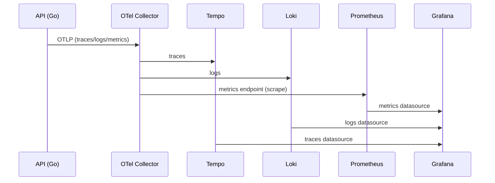

# Sniply — Onboarding Guide (Docker & Deploy)
This document explains **how to run, develop, migrate, and deploy** Sniply using Docker Compose.

If you are new to the project, **read it in order**.  
This README was written to prevent common mistakes and loss of context.

---

## Table of Contents

- [TL;DR (for experienced developers)](#tldr-for-experienced-developers)
- [Architecture Overview](#architecture-overview)
  - [Architecture Diagram (Mermaid)](#architecture-diagram-mermaid)
- [Repository Structure](#repository-structure)
- [Prerequisites](#prerequisites)
- [Command Convention](#command-convention)
- [Development](#development)
  - [Start environment](#start-environment)
  - [Run migrations](#run-migrations)
  - [Logs](#logs)
  - [Status](#status)
  - [Daily development cycle](#daily-development-cycle)
  - [Reset environment (DEV)](#reset-environment-dev)
- [Production](#production)
  - [Create environment file (outside Git)](#create-environment-file-outside-git)
  - [Load variables into the shell](#load-variables-into-the-shell)
  - [Start the stack](#start-the-stack)
  - [Run migrations (PROD)](#run-migrations-prod)
  - [Deploy / Update](#deploy--update)
  - [Operations (Production)](#operations-production)
- [Start the API debug](#start-the-api-debug)
- [OpenAPI (automatic with swaggo)](#openapi-automatic-with-swaggo)
- [Telemetry](#telemetry)
  - [Observability Flow (Mermaid)](#observability-flow-mermaid)
- [Examples for each endpoint (curl)](#examples-for-each-endpoint-curl)

---

## TL;DR (for experienced developers)

- **Never run `docker compose up` “raw”** → use the aliases (`DEV` / `PROD`)
- **Migrations do not run automatically** → they must be executed explicitly
- **Production exposes only 80/443** → everything else is internal
- **Secrets never go into Git**
- **Traefik is the only external entry point**

---

## Architecture Overview

Sniply runs as **a single Docker stack**, composed of:

- **Traefik** – Reverse proxy and TLS (HTTPS)
- **API (Go)** – Main service
- **PostgreSQL** – Containerized database
- **Observability** – Grafana, Prometheus, Loki, Tempo, OpenTelemetry

All services, except Traefik, run on internal networks.

```
Internet
   │
   ▼
Traefik (80/443)
   │
   ├── API
   │     └── Postgres
   │
   └── Grafana
         ├── Prometheus
         ├── Loki
         └── Tempo
```

### Architecture Diagram (Mermaid)

```mermaid
flowchart TD
  Internet((Internet)) --> Traefik[Traefik : 80/443]
  Traefik --> API[API (Go)]
  API --> DB[(PostgreSQL)]
  Traefik --> Grafana[Grafana]
  Grafana --> Prometheus[Prometheus]
  Grafana --> Loki[Loki]
  Grafana --> Tempo[Tempo]
```

---

## Repository Structure

```
.
├── compose.base.yml
├── compose.dev.yml
├── compose.prod.yml
├── Dockerfile
├── migrations/
├── grafana/
├── prometheus.yml
├── loki-config.yaml
├── tempo.yaml
├── otel-collector.yml
```

Prerequisites
---------------------------------------

**Development (local)**

You need:

- Docker >= 24
- Docker Compose v2 (`docker compose`)
- Free ports:
  - 8080 (API)
  - 5432 (Postgres)
  - 3001 (Grafana)
  - 9090, 3100, 3200, 4317 (telemetry)

**Production**

- Linux server with Docker + Docker Compose
- Ports 80 and 443 open
- DNS configured:
  - api.DOMAIN
  - grafana.DOMAIN
---

## Command Convention

**⚠️ Important rule
Never run only docker compose up.
Always use compose.base.yml + an override.**

### Development
```
DEV="docker compose -f compose.base.yml -f compose.dev.yml"
```

### Production
```
PROD="docker compose -f compose.base.yml -f compose.prod.yml"
```

---

## Development

### Start environment
```
$DEV up -d --build
```
This starts:
- API
- Postgres
- Observability
- Traefik (even in dev)

### Run migrations
```
$DEV --profile migrate up --abort-on-container-exit migrate
```

**⚠️ Important
The API does not run migrations by itself.
Always execute this command after starting the environment for the first time.**

### Logs
```
$DEV logs -f api
```

### Status
```
$DEV ps
```

### Daily development cycle

**Rebuild + restart**
```
$DEV up -d --build 
```

**Reapply migrations (if anything changed)**
```
$DEV --profile migrate up --abort-on-container-exit migrate
```

**Debug with Delve**
```
$DEV --profile debug up -d --build api-debug
```

**Debug logs:**
```
$DEV logs -f api-debug
```

**Stop debug:**
```
$DEV stop api-debug
```

---

###  Reset environment (DEV)

**Stop everything**
```
$DEV down
```

**Full reset (removes DB and volumes)**
```
$DEV down -v
```

⚠️ Never use -v in production

## Production

**Create environment file (outside Git)**

On the server:

```
sudo mkdir -p /etc/sniply
sudo nano /etc/sniply/sniply.env
sudo chmod 600 /etc/sniply/sniply.env
```

Example:

```
DOMAIN=example.com
ACME_EMAIL=you@example.com

POSTGRES_PASSWORD=super-secure-password
JWT_SECRET=very-long-random-secret

GRAFANA_ADMIN_USER=admin
GRAFANA_ADMIN_PASSWORD=strong-password

# htpasswd -nb user 'password'
GRAFANA_BASIC_AUTH=user:$apr1$HASH
```

**Load variables into the shell**
```
set -a; source /etc/sniply/sniply.env; set +a
```

### Start the stack
```
$PROD up -d
```

### Run migrations (PROD)
```
$PROD --profile migrate up --abort-on-container-exit migrate
```

### Deploy / Update
```
git pull

set -a; source /etc/sniply/sniply.env; set +a
$PROD up -d --build
$PROD --profile migrate up --abort-on-container-exit migrate
$PROD up -d --build api
```

### Operations (Production)

**Status**
```
$PROD ps
```

**Logs**
```
$PROD logs -f traefik
$PROD logs -f api
$PROD logs -f db
```

**Restart API**
```
$PROD restart api
```

**Access Postgres**
```
$PROD exec db psql -U sniply -d sniply
```

---

Start the API debug
----------------------------------------------
```bash
docker compose --profile debug up --build api-debug
```
**setup.json for vscode:**
```json
{
  "version": "0.2.0",
  "configurations": [
    {
      "name": "Attach Go (Delve remote)",
      "type": "go",
      "request": "attach",
      "mode": "remote",
      "host": "127.0.0.1",
      "port": 40000,
      "apiVersion": 2,
      "cwd": "${workspaceFolder}/src",
      "substitutePath": [
        {
          "from": "${workspaceFolder}/src",
          "to": "/app"
        }
      ]
    }
  ]
}
```

OpenAPI (automatic with swaggo)
----------------------------------------------------------

**1. Install swag CLI:**

```bash
go install github.com/swaggo/swag/cmd/swag@latest
```

**2. Generate docs (writes to `src/docs`):**

```bash
cd src
go generate ./...
```

**3. Start the API and open the Swagger UI:**
```
http://localhost:8080/swagger/index.html
```

Telemetry 
---------------------------------

Observability (Grafana, Prometheus, Loki, Tempo, OTEL)
This stack is split into two docker-compose files and connected by a shared Docker network.

**High-level flow**
```
API (OTLP) --> OTel Collector --> Tempo (traces)
                           \-> Loki (logs)
                           \-> Prometheus (metrics scrape)
```

### Observability Flow (Mermaid)



**What each file does (observability-related)**
- `src/cmd/api/main.go` initializes OTEL trace/metrics/logs, and DB telemetry. All signals use OTLP.
- `src/internal/httpapi/router.go` wires HTTP middlewares for traces, logs, and metrics.
- `src/internal/telemetry/trace.go` sets up OTLP trace exporter and tracer provider.
- `src/internal/telemetry/metrics.go` sets up OTLP metrics exporter and meter provider.
- `src/internal/telemetry/httpmetrics.go` defines HTTP metrics instruments (OTEL only).
- `src/internal/telemetry/logs.go` sets up OTLP log exporter and logger provider.
- `src/internal/telemetry/httplogs.go` emits structured HTTP logs with trace correlation.
- `src/internal/telemetry/otlp.go` centralizes OTLP endpoint resolution via envs.
- `src/internal/db/telemetry.go` adds DB spans + DB metrics (latency/errors).
- `src/internal/db/base.go` wraps the queryer to emit DB telemetry on each call.
- `src/observability/otel-collector.yml` receives OTLP and exports to Tempo (traces), Loki (logs), and a Prometheus scrape endpoint (metrics).
- `src/observability/prometheus.yml` scrapes only the collector metrics endpoint.
- `src/observability/tempo.yaml` configures Tempo storage and OTLP receiver.
- `src/observability/grafana/provisioning/datasources/datasources.yml` declares Prometheus, Loki, and Tempo datasources.
- `src/observability/grafana/dashboards/sniply-api.json` defines the HTTP and DB dashboards.
- `src/observability/docker-compose.yml` runs the observability stack and attaches the collector to the shared network.
- `src/docker-compose.yml` runs the app stack and configures OTEL endpoint + network.

**Signal mapping**
```
Traces:  API -> OTLP -> OTel Collector -> Tempo -> Grafana
Logs:    API -> OTLP -> OTel Collector -> Loki  -> Grafana
Metrics: API -> OTLP -> OTel Collector -> Prometheus -> Grafana
DB:      API -> OTLP -> Otel Collector -> Prometheus -> Grafana
```
**DB telemetry (traces + metrics)**
- Spans: each DB call (Query/QueryRow/Exec) creates a span named `DB <OPERATION>` with attributes like `db.system=postgresql` and `db.operation=SELECT/INSERT/...`.
- Metrics:
  - `sniply_db_query_duration_seconds` (histogram) with labels `db.system`, `db.operation`, `db.status`
  - `sniply_db_query_errors_total` (counter) with labels `db.system`, `db.operation`, `db.status`
- Implementation files:
  - `src/internal/db/telemetry.go` contains the instrumentation and metrics definitions.
  - `src/internal/db/base.go` wraps the queryer to emit spans/metrics.
  - `src/cmd/api/main.go` calls `db.InitTelemetry("sniply-api")` during startup.
  
**Key environment variable**
- `OTEL_EXPORTER_OTLP_ENDPOINT=otel-collector:4317` (set in `src/docker-compose.yml`)

**Notes**
- The API listens on the address configured in `cmd/api` (check the file if you need to change port).
- Use `Authorization: Bearer <token>` for protected endpoints. Get a token via `POST /v1/auth/login`.

Examples for each endpoint (curl)
---------------------------------

Below are minimal curl examples for the main API endpoints. Replace `localhost:8080` and `$TOKEN` with your values.

# Health
```bash
curl -v http://localhost:8080/health
```

# Auth: login (obtain token)
```bash
curl -v -X POST http://localhost:8080/v1/auth/login   -H 'Content-Type: application/json'   -d '{"email":"demo@local","password":"x"}'
# Response: {"access_token":"...","token_type":"Bearer","expires_at":"..."}
```

# Users: create (public)
```bash
curl -v -X POST http://localhost:8080/v1/users   -H 'Content-Type: application/json'   -d '{"email":"new@local","password":"secret"}'
```

# Users: get current user (protected)
```bash
curl -v -H "Authorization: Bearer $TOKEN" http://localhost:8080/v1/users/me
```

# Users: update current user (protected)
```bash
curl -v -X PUT http://localhost:8080/v1/users/me   -H 'Content-Type: application/json'   -H "Authorization: Bearer $TOKEN"   -d '{"email":"me@local","password":"newpass"}'
```

# Users: delete current user (protected)
```bash
curl -v -X DELETE http://localhost:8080/v1/users/me   -H "Authorization: Bearer $TOKEN"
```

# Users: list (admin)
```bash
curl -v -H "Authorization: Bearer $ADMIN_TOKEN" http://localhost:8080/v1/users
```

# Snippets: list / search (protected)
```bash
curl -v 'http://localhost:8080/v1/snippets?q=example&limit=10'
```

# Snippets: get by id (protected)
```bash
curl -v http://localhost:8080/v1/snippets/snp_abc123
```

# Snippets: create (protected)
```bash
curl -v -X POST http://localhost:8080/v1/snippets   -H 'Content-Type: application/json'   -H "Authorization: Bearer $TOKEN"   -d '{"name":"Example","content":"print(\"hi\")","language":"python","tags":["dev"],"visibility":"public"}'
```

# Snippets: update (protected)
```bash
curl -v -X PUT http://localhost:8080/v1/snippets/snp_abc123   -H 'Content-Type: application/json'   -H "Authorization: Bearer $TOKEN"   -d '{"name":"Updated","content":"x","language":"txt"}'
```

# Snippets: delete (protected)
```bash
curl -v -X DELETE http://localhost:8080/v1/snippets/snp_abc123   -H "Authorization: Bearer $TOKEN"
```
