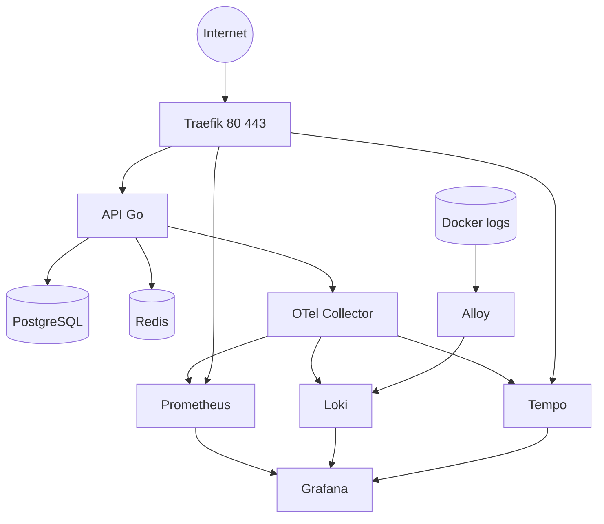
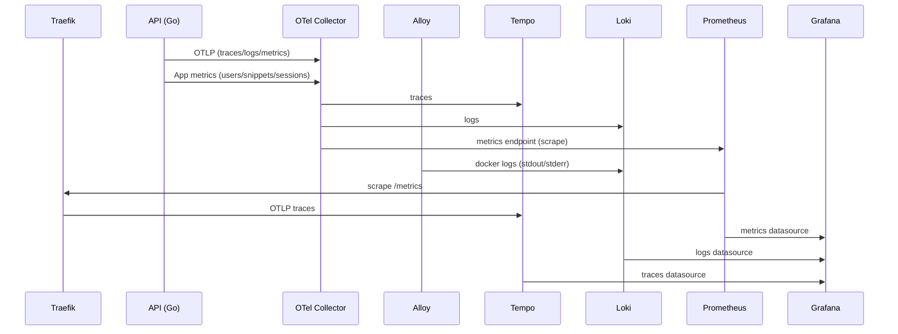

# sniply_api — Onboarding Guide (Docker & Deploy)
This document explains **how to run, develop, migrate, and deploy** sniply_api using Docker Compose.

If you are new to the project, **read it in order**.  
This README was written to prevent common mistakes and loss of context.

---

## Table of Contents

- [TL;DR (for experienced developers)](#tldr-for-experienced-developers)
- [Architecture Overview](#architecture-overview)
  - [Architecture Diagram (Mermaid)](#architecture-diagram-mermaid)
- [Repository Structure](#repository-structure)
- [Prerequisites](#prerequisites)
- [Command Convention](#command-convention)
- [Development](#development)
  - [Start environment](#start-environment)
  - [Dev HTTPS endpoints](#dev-https-endpoints)
  - [Run migrations](#run-migrations)
  - [Logs](#logs)
  - [Status](#status)
  - [Daily development cycle](#daily-development-cycle)
  - [Reset environment (DEV)](#reset-environment-dev)
- [Local HTTPS with mkcert (Linux + WSL)](#local-https-with-mkcert-linux--wsl)
- [Production](#production)
  - [Create environment file (outside Git)](#create-environment-file-outside-git)
  - [Load variables into the shell](#load-variables-into-the-shell)
  - [Start the stack](#start-the-stack)
  - [Run migrations (PROD)](#run-migrations-prod)
  - [Deploy / Update](#deploy--update)
  - [Operations (Production)](#operations-production)
- [Start the API debug](#start-the-api-debug)
- [OpenAPI (automatic with swaggo)](#openapi-automatic-with-swaggo)
- [Telemetry](#telemetry)
  - [Observability Flow (Mermaid)](#observability-flow-mermaid)
- [Examples for each endpoint (curl)](#examples-for-each-endpoint-curl)

---

## TL;DR (for experienced developers)

- **Never run `docker compose up` “raw”** → use the aliases (`DEV` / `PROD`)
- **Migrations do not run automatically** → they must be executed explicitly
- **In production, Traefik exposes only 80/443** → in dev, extra ports are published (including 8081 for the dashboard)
- **Secrets never go into Git**
- **In production, Traefik is the only external entry point**

---

## Architecture Overview

sniply_api runs as **a single Docker stack**, composed of:

- **Traefik** – Reverse proxy and TLS (HTTPS)
- **API (Go)** – Main service
- **PostgreSQL** – Containerized database
- **Redis** – Sessions, cache, and rate limiting
- **OTel Collector** – Receives OTLP from the API and exports to the observability backends
- **Observability** – Grafana, Prometheus, Loki, Tempo

All services, except Traefik, run on internal networks. The API, Postgres, and Redis use the `app` network, observability uses `sniply-observability`, and Traefik routes via `proxy`.

```
Internet
   │
   ▼
Traefik (80/443)
   │
   └── API
         ├── Postgres
         └── Redis (sessions/cache/rate limit)
Prometheus / Loki / Tempo -> Grafana
API -> OTel Collector -> (Prometheus/Loki/Tempo)
```

### Architecture Diagram (Mermaid)



**Application flow**
```
Client -> Traefik -> API
API -> Redis (sessions, cache, rate limiting)
API -> PostgreSQL (users, snippets)
```

---

## Repository Structure

```
.
├── README.md
├── README.dev.md
├── src/
│   ├── compose.base.yml
│   ├── compose.dev.yml
│   ├── compose.prod.yml
│   ├── Dockerfile
│   ├── migrations/
│   └── observability/
│       ├── grafana/
│       ├── prometheus.yml
│       ├── loki-config.yaml
│       ├── tempo.yaml
│       └── otel-collector.yml
```

Prerequisites
---------------------------------------

**Development (local)**

You need:

- Docker >= 24
- Docker Compose v2 (`docker compose`)
- Free ports:
  - 80/443 (Traefik)
  - 8081 (Traefik dashboard)
  - 8080 (API)
  - 5432 (Postgres)
  - 6379 (Redis)
  - 3001 (Grafana)
  - 9090, 3100, 3200, 4317 (telemetry)

**Production**

- Linux server with Docker + Docker Compose
- Ports 80 and 443 open
- DNS configured:
  - api.DOMAIN
  - grafana.DOMAIN
---

## Command Convention

**⚠️ Important rule
Never run only docker compose up.
Always use `src/compose.base.yml` + an override.**

### Development
```
DEV="docker compose -f src/compose.base.yml -f src/compose.dev.yml"
```

### Production
```
PROD="docker compose -f src/compose.base.yml -f src/compose.prod.yml"
```

---

## Development

### Start environment
```
$DEV up -d --build
```
This starts:
- API
- Postgres
- Observability
- Traefik (even in dev)

### Dev HTTPS endpoints

With local TLS enabled, use these URLs:
- API: https://api.localhost
- Grafana: https://grafana.localhost
- Traefik dashboard: https://localhost/dashboard/#/

### Run migrations
```
$DEV --profile migrate up --abort-on-container-exit migrate
```

**⚠️ Important
The API does not run migrations by itself.
Always execute this command after starting the environment for the first time.**

### Logs
```
$DEV logs -f api
```

### Status
```
$DEV ps
```

### Daily development cycle

**Rebuild + restart**
```
$DEV up -d --build 
```

**Reapply migrations (if anything changed)**
```
$DEV --profile migrate up --abort-on-container-exit migrate
```

**Debug with Delve**
```
$DEV --profile debug up -d --build api-debug
```

**Debug logs:**
```
$DEV logs -f api-debug
```

**Stop debug:**
```
$DEV stop api-debug
```

---

###  Reset environment (DEV)

**Stop everything**
```
$DEV down
```

**Full reset (removes DB and volumes)**
```
$DEV down -v
```

⚠️ Never use -v in production

## Local HTTPS with mkcert (Linux + WSL)

This project uses local HTTPS in dev (Traefik + custom certs). The steps below create and trust a local CA and generate certs for the dev hosts.

### 1) Install mkcert

Debian/Ubuntu:
```
sudo apt update
sudo apt install -y libnss3-tools
sudo apt install -y mkcert
```

If you use Homebrew on Linux:
```
brew install mkcert
```

Or download the mkcert binary and add it to your PATH.

### 2) Install the local CA (once per machine)
```
mkcert -install
```

### 3) Generate certs for dev hosts

From the repo root:
```
mkcert -cert-file src/certs/localhost.pem -key-file src/certs/localhost-key.pem \
  localhost 127.0.0.1 api.localhost grafana.localhost traefik.localhost
```

This creates:
```
src/certs/localhost.pem
src/certs/localhost-key.pem
```

### WSL: trust the mkcert CA on Windows

You need to install the **mkcert root CA** on Windows (not the host cert).

1) Find the CA path in WSL:
```
mkcert -CAROOT
```

2) Copy the root CA to Windows (example):
```
cp "$(mkcert -CAROOT)/rootCA.pem" /mnt/c/Users/<SEU_USUARIO>/Downloads/rootCA.pem
```

3) Install into Windows "Trusted Root Certification Authorities":

Open PowerShell **as Administrator** and run:
```
certutil -delstore -f "Root" "mkcert development CA"
certutil -addstore -f "Root" "$env:USERPROFILE\\Downloads\\rootCA.pem"
```

## Production

### Create environment file (outside Git)

On the server:

```
sudo mkdir -p /etc/sniply
sudo nano /etc/sniply/sniply.env
sudo chmod 600 /etc/sniply/sniply.env
```

Example:

```
DOMAIN=example.com
ACME_EMAIL=you@example.com

POSTGRES_PASSWORD=super-secure-password

GRAFANA_ADMIN_USER=admin
GRAFANA_ADMIN_PASSWORD=strong-password

# htpasswd -nb user 'password'
GRAFANA_BASIC_AUTH=user:$apr1$HASH
```

### Load variables into the shell
```
set -a; source /etc/sniply/sniply.env; set +a
```

### Start the stack
```
$PROD up -d
```

### Run migrations (PROD)
```
$PROD --profile migrate up --abort-on-container-exit migrate
```

### Deploy / Update
```
git pull

set -a; source /etc/sniply/sniply.env; set +a
$PROD up -d --build
$PROD --profile migrate up --abort-on-container-exit migrate
$PROD up -d --build api
```

### Operations (Production)

**Status**
```
$PROD ps
```

**Logs**
```
$PROD logs -f traefik
$PROD logs -f api
$PROD logs -f db
```

**Restart API**
```
$PROD restart api
```

**Access Postgres**
```
$PROD exec db psql -U sniply -d sniply
```

---

Start the API debug
----------------------------------------------
```bash
$DEV --profile debug up -d --build api-debug
```
**setup.json for vscode:**
```json
{
  "version": "0.2.0",
  "configurations": [
    {
      "name": "Attach Go (Delve remote)",
      "type": "go",
      "request": "attach",
      "mode": "remote",
      "host": "127.0.0.1",
      "port": 40000,
      "apiVersion": 2,
      "cwd": "${workspaceFolder}/src",
      "substitutePath": [
        {
          "from": "${workspaceFolder}/src",
          "to": "/app"
        }
      ]
    }
  ]
}
```

OpenAPI (automatic with swaggo)
----------------------------------------------------------

**1. Install swag CLI:**

```bash
go install github.com/swaggo/swag/cmd/swag@latest
```

**2. swag not found in path**

verify if swag is in GOPATH

```bash
go env GOPATH
ls -l "$(go env GOPATH)/bin"
```

If found, add in PATH

```bash
export PATH="$(go env GOPATH)/bin:$PATH"
```

**3. Generate docs (writes to `src/docs`):**

```bash
cd src
go generate ./...
```

**4. Start the API and open the Swagger UI:**
```
http://localhost:8080/swagger/index.html
```

Telemetry 
---------------------------------

Observability (Grafana, Prometheus, Loki, Tempo, OTEL, Alloy, App Metrics)
This stack runs in the same compose setup as the API and is connected through the `sniply-observability` network.

**High-level flow**
```
API (OTLP) --> OTel Collector --> Tempo (traces)
                           \-> Loki (logs)
                           \-> Prometheus (metrics scrape)
API (app metrics) --------> OTel Collector --> Prometheus (metrics scrape)
Traefik (Prometheus metrics) --> Prometheus (metrics scrape)
Docker logs (all containers) --> Alloy --> Loki
```

### Observability Flow (Mermaid)



**What each file does (observability-related)**
- `src/cmd/api/main.go` initializes OTEL trace/metrics/logs, and DB telemetry. All signals use OTLP.
- `src/internal/httpapi/router.go` wires HTTP middlewares for traces, logs, and metrics.
- `src/internal/telemetry/trace.go` sets up OTLP trace exporter and tracer provider.
- `src/internal/telemetry/metrics.go` sets up OTLP metrics exporter and meter provider.
- `src/internal/telemetry/httpmetrics.go` defines HTTP metrics instruments (OTEL only).
- `src/internal/telemetry/logs.go` sets up OTLP log exporter and logger provider.
- `src/internal/telemetry/httplogs.go` emits structured HTTP logs with trace correlation.
- `src/internal/telemetry/otlp.go` centralizes OTLP endpoint resolution via envs.
- `src/internal/db/telemetry.go` adds DB spans + DB metrics (latency/errors).
- `src/internal/db/base.go` wraps the queryer to emit DB telemetry on each call.
- `src/observability/otel-collector.yml` receives OTLP and exports to Tempo (traces), Loki (logs), and a Prometheus scrape endpoint (metrics).
- `src/observability/alloy-config.alloy` scrapes Docker logs for all containers and ships them to Loki (excluding API logs to avoid duplication).
- `src/observability/prometheus.yml` scrapes the collector metrics endpoint and Traefik metrics.
- `src/observability/tempo.yaml` configures Tempo storage and OTLP receiver.
- `src/observability/grafana/provisioning/datasources/datasources.yml` declares Prometheus, Loki, and Tempo datasources.
- `src/observability/grafana/dashboards/sniply-api.json` defines the HTTP and DB dashboards.
- `src/observability/grafana/dashboards/sniply-growth.json` defines user/snippet/session growth stats.
- `src/compose.base.yml` defines the full stack, shared networks, and OTEL endpoint for the API.
- `src/compose.dev.yml` exposes dev ports and Traefik dashboard routing.
- `src/compose.prod.yml` contains production overrides.

**Signal mapping**
```
Traces:  API -> OTLP -> OTel Collector -> Tempo -> Grafana
Logs:    API -> OTLP -> OTel Collector -> Loki  -> Grafana
Metrics: API -> OTLP -> OTel Collector -> Prometheus -> Grafana
Traefik metrics: Traefik -> Prometheus -> Grafana
DB:      API -> OTLP -> Otel Collector -> Prometheus -> Grafana
```
**DB telemetry (traces + metrics)**
- Spans: each DB call (Query/QueryRow/Exec) creates a span named `DB <OPERATION>` with attributes like `db.system=postgresql` and `db.operation=SELECT/INSERT/...`.
- Metrics:
  - `sniply_db_query_duration_seconds` (histogram) with labels `db.system`, `db.operation`, `db.status`
  - `sniply_db_query_errors_total` (counter) with labels `db.system`, `db.operation`, `db.status`
- Implementation files:
  - `src/internal/db/telemetry.go` contains the instrumentation and metrics definitions.
  - `src/internal/db/base.go` wraps the queryer to emit spans/metrics.
  - `src/cmd/api/main.go` calls `db.InitTelemetry("sniply-api")` during startup.
  
**Key environment variable**
- `OTEL_EXPORTER_OTLP_ENDPOINT=otel-collector:4317` (set in `src/compose.base.yml`)

**Notes**
- The API listens on the address configured in `cmd/api` (check the file if you need to change port).
- Use the HttpOnly session cookie for protected endpoints. Login sets the cookie via `Set-Cookie`.

Examples for each endpoint (curl)
---------------------------------

Below are minimal curl examples for the main API endpoints. Replace `localhost:8080` with your values.

# Health
```bash
curl -v http://localhost:8080/health
```

# Auth: login (store session cookie)
```bash
curl -v -c cookies.txt -X POST http://localhost:8080/v1/auth/login   -H 'Content-Type: application/json'   -d '{"email":"demo@local","password":"x"}'
# Response: {"session_expires_at":"..."}
```

# Users: create (public)
```bash
curl -v -X POST http://localhost:8080/v1/users   -H 'Content-Type: application/json'   -d '{"email":"new@local","password":"secret"}'
```

# Users: get current user (protected)
```bash
curl -v -b cookies.txt http://localhost:8080/v1/users/me
```

# Users: update current user (protected)
```bash
curl -v -X PUT http://localhost:8080/v1/users/me   -H 'Content-Type: application/json'   -b cookies.txt   -d '{"email":"me@local","password":"newpass"}'
```

# Users: delete current user (protected)
```bash
curl -v -X DELETE http://localhost:8080/v1/users/me   -b cookies.txt
```

# Users: list (admin)
```bash
curl -v -b cookies.txt http://localhost:8080/v1/users
```

# Snippets: list / search (protected)
```bash
curl -v -b cookies.txt 'http://localhost:8080/v1/snippets?q=example&limit=10'
```

# Snippets: get by id (protected)
```bash
curl -v -b cookies.txt http://localhost:8080/v1/snippets/snp_abc123
```

# Snippets: create (protected)
```bash
curl -v -X POST http://localhost:8080/v1/snippets   -H 'Content-Type: application/json'   -b cookies.txt   -d '{"name":"Example","content":"print(\"hi\")","language":"python","tags":["dev"],"visibility":"public"}'
```

# Snippets: update (protected)
```bash
curl -v -X PUT http://localhost:8080/v1/snippets/snp_abc123   -H 'Content-Type: application/json'   -b cookies.txt   -d '{"name":"Updated","content":"x","language":"txt"}'
```

# Snippets: delete (protected)
```bash
curl -v -X DELETE http://localhost:8080/v1/snippets/snp_abc123   -b cookies.txt
```

# Auth: logout (clear session cookie)
```bash
curl -v -X POST http://localhost:8080/v1/auth/logout   -b cookies.txt
```
